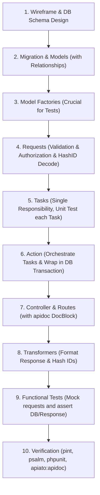

# Apiato 11.x Porto API Skill

Use this skill for Laravel / Apiato 11.x backend work in Porto architecture.

## Quick mental model

Apiato is not classic MVC. Think in **business domains** and **single-responsibility layers**.

```txt
Route -> Request -> Controller -> Action -> Task -> Repository/Model -> Transformer
```

- **Container** = business domain / bounded context, not necessarily one model.
- **Model** = database table representation.
- **Action** = one complete use case.
- **Task** = one reusable small job.
- **Repository** = data access adapter and query criteria surface.
- **Transformer** = public JSON response shape.
- **Event/Listener** = decouple side effects from core use case.

---

## Quy trình phát triển chuẩn (Standard Development Workflow)

Để tối ưu hóa tốc độ code và tránh việc phải sửa đi sửa lại do thiếu dependency, hãy luôn tuân thủ quy trình phát triển tuần tự dưới đây:



### Chi tiết các bước:
1. **Wireframe & DB Schema**: Xác định yêu cầu UI, các thực thể, kiểu dữ liệu, các ràng buộc và mối quan hệ giữa các bảng.
2. **Migration & Models**: Viết migration (chú ý thêm index cho khóa ngoại, các trường filter/sort) và Model (khai báo `$fillable`, `$casts`, và các Eloquent relationships).
3. **Model Factories**: Tạo Factory cho Model ngay lập tức. Đây là bước bắt buộc để hỗ trợ viết test tự động ở các bước sau.
4. **Requests**: Định nghĩa Request class cho endpoint để lo validate payload, phân quyền (`authorize()`) và decode Hash ID.
5. **Tasks (Đơn nhiệm)**: Xác định tất cả các nhiệm vụ nhỏ cần thực thi. Nếu chưa có Task sẵn sàng, hãy tạo mới và viết Unit Test cho từng Task một cách độc lập.
6. **Action (Nhạc trưởng)**: Thiết kế Action để điều phối các Task. Bắt buộc bọc trong `DB::transaction()` nếu có nhiều bước ghi dữ liệu.
7. **Controller & Route**: Tạo Controller (giữ cực kỳ mỏng) và Route. Viết ngay tài liệu `@api` DocBlock chuẩn chỉnh để tránh lỗi khi gen tài liệu.
8. **Transformers**: Thiết kế cấu trúc JSON đầu ra cho API, đảm bảo hash toàn bộ primary/foreign IDs và eager load các class liên kết.
9. **Functional Tests**: Viết test giả lập HTTP request gửi đến endpoint để kiểm tra tính đúng đắn của toàn bộ luồng dữ liệu (chỉ số HTTP, cấu trúc JSON trả về, dữ liệu trong database).
10. **Verify & Gen Doc**: Chạy `pint`, `psalm`, `phpunit` và chạy `php artisan apiato:apidoc` để đảm bảo chất lượng code sạch sẽ, không có warning.

---

## When starting a feature

1. Sketch a tiny UI/wireframe first if requirements are unclear.
2. Identify resources/models, REST endpoints, payloads, response shape, permissions.
3. Decide Container by business domain:
   - Same lifecycle/context, keep together: `Order`, `OrderItem`, `OrderHistory`.
   - Independent capability, separate Container: `Payment`, `Notification`, `Chat`.
4. Prefer existing Container/Task/Action if the feature belongs there.
5. Treat production requirements as design inputs from the start, not later optimizations: indexes, pagination, authorization, validation caps, rollback, rate limits, and query shape.

---

## Production-grade rule priority

Use these as hard rules when generating or reviewing Apiato code:

- **Index first**: every foreign key, frequent filter, sort, and compound filter+sort query needs a matching DB index in the migration.
- **Pagination first**: list APIs must paginate or enforce a safe limit. No unbounded `all()`/`get()` for user-facing lists.
- **Transaction in Action**: when a use case writes multiple tables or calls multiple write Tasks, wrap the orchestration in the Action using `DB::transaction()` or Apiato `transactionalRun()`. Do not hide multi-step workflow transactions inside a low-level Task.
- **Task stays atomic**: Task performs one job and should be reusable outside the original use case.
- **Request is the gate**: validate, authorize, decode hash IDs, cap strings, cap list query params before Action.
- **Repository is the query contract**: expose only safe searchable fields through `$fieldSearchable`.
- **Transformer is public contract**: hide DB internals, return hashed IDs, avoid secret/internal fields.
- **Events are side-effect boundaries**: use Events/Listeners for notifications, audit logs, integrations, cache invalidation, broadcasts, and async work. Do not put core required state changes only in a Listener.
- **Frontend convenience must remain bounded**: RequestCriteria is useful, but only with allowlisted fields, indexes, max limits, and include definitions.

---

## Container guidance

- Default section for this repo/company style: `AppSection`.
- Container name: `PascalCase`, domain-focused: `Book`, `Order`, `Payment`.
- API-only projects usually choose `API` UI.
- Prefer **SAC** (single action controller): one controller method/file per endpoint.
- Do not create a new Container just because there is a new table.

---

## Layer rules

### Route

- Location: `UI/API/Routes`.
- File pattern: `{ActionName}.v1.private.php` or `{ActionName}.v1.public.php`.
- Private routes use auth middleware/guard.
- **Quy tắc viết DocBlock cho tài liệu API (`apidoc`)**:
  - Bắt buộc viết DocBlock comment `@api` đầy đủ ở đầu mỗi file Route mới. Không được bỏ sót.
  - Phân biệt rõ các thẻ để tránh lỗi cảnh báo (warnings):
    - **`@apiParam`**: Chỉ dùng cho tham số nằm trên URL path (ví dụ: `/orders/:id` thì dùng `@apiParam {String} id`).
    - **`@apiBody`**: Dùng cho tham số truyền trong Request Body (JSON payload của POST/PUT/PATCH).
    - **`@apiQuery`**: Dùng cho tham số truyền qua URL Query string (ví dụ: `?limit=15` hoặc `?include=items`).
  - Chạy lệnh `php artisan apiato:apidoc` đầu ra phải sạch sẽ, không có bất kỳ warning nào.

#### API DocBlock Templates (Snippets Copy-Paste)

> [!TIP]
> Sử dụng các mẫu chuẩn dưới đây để viết nhanh DocBlock cho các API CRUD mà không sợ gặp lỗi warning khi render apidoc.

##### 1. GET (List) với Query Parameters & Pagination
```php
/**
 * @apiGroup           Order
 * @apiName            GetAllOrders
 *
 * @api                {GET} /v1/orders Get All Orders
 * @apiDescription     Lấy danh sách đơn hàng có phân trang, lọc và tìm kiếm.
 *
 * @apiHeader          {String} accept=application/json
 * @apiHeader          {String} authorization=Bearer
 *
 * @apiQuery           {String} [search] Nội dung tìm kiếm, ví dụ: 'shipping_carrier:AHT' hoặc 'id:XyZ123'
 * @apiQuery           {String} [searchFields] Toán tử tìm kiếm, ví dụ: 'shipping_carrier:like;id:='
 * @apiQuery           {String} [orderBy] Trường sắp xếp, ví dụ: 'created_at'
 * @apiQuery           {String} [sortedBy] Chiều sắp xếp (asc hoặc desc)
 * @apiQuery           {String} [filter] Chỉ lấy các trường cần thiết, phân tách bằng dấu chấm phẩy (;), ví dụ: 'id;status;total'
 * @apiQuery           {String} [include] Eager load các mối quan hệ liên kết, ví dụ: 'items,customer'
 * @apiQuery           {Number} [limit] Số bản ghi trên mỗi trang (mặc định: 15)
 * @apiQuery           {Number} [page] Số trang cần lấy
 *
 * @apiSuccessExample  {json} Success-Response:
 * HTTP/1.1 200 OK
 * {
 *     "data": [
 *         {
 *             "object": "Order",
 *             "id": "XyZ123",
 *             "status": "pending",
 *             "total": 150000,
 *             "created_at": "2026-07-17T08:00:00Z"
 *         }
 *     ],
 *     "meta": {
 *         "pagination": {
 *             "total": 1,
 *             "count": 1,
 *             "per_page": 15,
 *             "current_page": 1,
 *             "total_pages": 1
 *         }
 *     }
 * }
 */
```

##### 2. GET (Detail) với URL Parameter
```php
/**
 * @apiGroup           Order
 * @apiName            FindOrderById
 *
 * @api                {GET} /v1/orders/:id Find Order By Id
 * @apiDescription     Lấy thông tin chi tiết của một đơn hàng theo ID.
 *
 * @apiHeader          {String} accept=application/json
 * @apiHeader          {String} authorization=Bearer
 *
 * @apiParam           {String} id ID của đơn hàng cần lấy (bắt buộc trên URL)
 *
 * @apiQuery           {String} [include] Eager load các mối quan hệ liên kết, ví dụ: 'items,customer'
 *
 * @apiSuccessExample  {json} Success-Response:
 * HTTP/1.1 200 OK
 * {
 *     "data": {
 *         "object": "Order",
 *         "id": "XyZ123",
 *         "status": "pending",
 *         "total": 150000
 *     }
 * }
 */
```

##### 3. POST (Create) với Request Body
```php
/**
 * @apiGroup           Order
 * @apiName            CreateOrder
 *
 * @api                {POST} /v1/orders Create Order
 * @apiDescription     Tạo đơn hàng mới.
 *
 * @apiHeader          {String} accept=application/json
 * @apiHeader          {String} authorization=Bearer
 *
 * @apiBody            {String} customer_id ID của khách hàng (dạng HashID, bắt buộc)
 * @apiBody            {Array} items Danh sách các sản phẩm cần mua (bắt buộc)
 * @apiBody            {String} items.*.product_id ID của sản phẩm (dạng HashID, bắt buộc)
 * @apiBody            {Number} items.*.qty Số lượng mua của sản phẩm (bắt buộc, tối thiểu là 1)
 * @apiBody            {String} [shipping_carrier] Đơn vị vận chuyển (tùy chọn)
 *
 * @apiSuccessExample  {json} Success-Response:
 * HTTP/1.1 200 OK
 * {
 *     "data": {
 *         "object": "Order",
 *         "id": "XyZ123",
 *         "total": 150000,
 *         "status": "pending"
 *     }
 * }
 */
```

##### 4. PATCH (Update) với URL Param & Request Body
```php
/**
 * @apiGroup           Order
 * @apiName            UpdateOrder
 *
 * @api                {PATCH} /v1/orders/:id Update Order
 * @apiDescription     Cập nhật thông tin đơn hàng hiện tại.
 *
 * @apiHeader          {String} accept=application/json
 * @apiHeader          {String} authorization=Bearer
 *
 * @apiParam           {String} id ID của đơn hàng cần cập nhật (bắt buộc trên URL)
 *
 * @apiBody            {String} [status] Cập nhật trạng thái đơn hàng (pending, paid, cancelled)
 * @apiBody            {String} [shipping_carrier] Cập nhật đơn vị vận chuyển
 *
 * @apiSuccessExample  {json} Success-Response:
 * HTTP/1.1 200 OK
 * {
 *     "data": {
 *         "object": "Order",
 *         "id": "XyZ123",
 *         "status": "paid",
 *         "shipping_carrier": "AHT"
 *     }
 * }
 */
```

##### 5. DELETE với URL Param
```php
/**
 * @apiGroup           Order
 * @apiName            DeleteOrder
 *
 * @api                {DELETE} /v1/orders/:id Delete Order
 * @apiDescription     Xóa đơn hàng theo ID.
 *
 * @apiHeader          {String} accept=application/json
 * @apiHeader          {String} authorization=Bearer
 *
 * @apiParam           {String} id ID của đơn hàng cần xóa (bắt buộc trên URL)
 *
 * @apiSuccessExample  {json} Success-Response:
 * HTTP/1.1 204 No Content
 */
```

---

### Request

- Location: `UI/API/Requests`.
- One Request per endpoint.
- Must define `rules(): array` and `authorize(): bool`.
- Use:
  - `$access` for roles/permissions.
  - `$decode` for hashed IDs from body/query.
  - `$urlParameters` for route params like `{id}`.
- Put route ID in both `$urlParameters` and `$decode` when validating hashed URL IDs.
- Use `sanitizeInput([...])` in Actions for create/update payload allowlisting.
- Always cap strings with `max`, especially create/update fields.
- Use `sometimes` validation rule for fields in Update Requests to allow partial resource updates.
- Validate list query params: `limit`, `page`, `search`, `searchFields`, `orderBy`, `sortedBy`, `filter`, `include`.
- For create/update, align validation max lengths with database column lengths.
- For private endpoints, never leave `authorize()` as `true` unless intentionally public-to-authenticated and documented.

---

### Controller

- Keep thin.
- Accept Request, call Action, return response/Transformer.
- No DB query, no business orchestration.

---

### Action

- Orchestrates use case.
- Bắt buộc lập kế hoạch và phân rã đầy đủ các Task cần thiết trước khi viết Action.
- Calls one or more Tasks. Điều phối 100% qua các Task, tuyệt đối không viết logic truy vấn DB hay xử lý Eloquent trực tiếp trong Action.
- Owns workflow-level transactions when multiple write Tasks must succeed/fail together.
- Throw meaningful Apiato/Ship exceptions.

#### Handling Complex Relations & Transactions in Action

Khi xử lý các hành động có cấu trúc phức tạp và ảnh hưởng đến nhiều bảng (như luồng đặt hàng liên quan tới Khách hàng, Sản phẩm, Tồn kho, và Chi tiết đơn hàng):

1. **Chuẩn bị dữ liệu**: Đọc dữ liệu đầu vào từ payload mảng (`$data`). Sử dụng các Task dạng `Find...` hoặc `Get...` để lấy và kiểm tra dữ liệu trước khi thực thi ghi DB.
2. **Database Transaction**: Bọc toàn bộ các thao tác ghi dữ liệu của nhiều Task khác nhau trong `DB::transaction()` để đảm bảo tính nguyên tử (Atomicity).
3. **Phân tách trách nhiệm (SRP)**: Không gộp tất cả logic tạo cha và con vào 1 Task lớn. Tạo riêng các Task nhỏ đơn nhiệm như:
   - `CreateOrderTask` (chỉ tạo bản ghi order chính).
   - `CreateOrderItemTask` (chỉ tạo một chi tiết order item).
   - `UpdateProductStockTask` (chỉ xử lý trừ/cộng tồn kho sản phẩm).
4. **Tách rời Event Side-Effects**: Dispatch các domain events (như gửi email, webhook) ở cuối Action, **bên ngoài block Transaction**, đảm bảo transaction đã commit thành công rồi mới trigger side-effects.

##### Ví dụ code minh họa Action đạt chuẩn:
```php
namespace App\Containers\AppSection\Order\Actions;

use App\Containers\AppSection\Order\Models\Order;
use App\Containers\AppSection\Order\Tasks\CreateOrderItemTask;
use App\Containers\AppSection\Order\Tasks\CreateOrderTask;
use App\Containers\AppSection\Order\Tasks\FindCustomerByIdTask;
use App\Containers\AppSection\Order\Tasks\FindProductByIdTask;
use App\Containers\AppSection\Order\Tasks\UpdateProductStockTask;
use App\Containers\AppSection\Order\Events\OrderCreatedEvent;
use App\Ship\Exceptions\NotFoundException;
use App\Ship\Parents\Actions\Action as ParentAction;
use Illuminate\Support\Facades\DB;

class CreateOrderAction extends ParentAction
{
    public function __construct(
        private FindCustomerByIdTask $findCustomerByIdTask,
        private FindProductByIdTask $findProductByIdTask,
        private CreateOrderTask $createOrderTask,
        private CreateOrderItemTask $createOrderItemTask,
        private UpdateProductStockTask $updateProductStockTask
    ) {}

    public function run(array $data): Order
    {
        // Bước 1: Kiểm tra thực thể liên quan (Customer) trước khi ghi dữ liệu
        $customer = $this->findCustomerByIdTask->run($data['customer_id']);

        $totalAmount = 0;
        $orderItemsData = [];

        // Bước 2: Kiểm tra tồn kho & chuẩn bị dữ liệu chi tiết
        foreach ($data['items'] as $item) {
            $product = $this->findProductByIdTask->run($item['product_id']);

            if ($product->stock < $item['qty']) {
                throw new \InvalidArgumentException("Sản phẩm {$product->name} không đủ số lượng trong kho.");
            }

            $totalAmount += $product->price * $item['qty'];
            $orderItemsData[] = [
                'product' => $product,
                'qty' => $item['qty'],
                'price' => $product->price,
            ];
        }

        // Bước 3: Ghi dữ liệu đồng bộ trong Database Transaction
        $order = DB::transaction(function () use ($customer, $totalAmount, $orderItemsData, $data) {
            // 3.1. Tạo đơn hàng cha
            $order = $this->createOrderTask->run([
                'customer_id' => $customer->id,
                'total' => $totalAmount,
                'status' => 'pending',
                'shipping_carrier' => $data['shipping_carrier'] ?? null,
            ]);

            // 3.2. Tạo các chi tiết đơn hàng con và cập nhật kho hàng
            foreach ($orderItemsData as $itemData) {
                $this->createOrderItemTask->run([
                    'order_id' => $order->id,
                    'product_id' => $itemData['product']->id,
                    'qty' => $itemData['qty'],
                    'price' => $itemData['price'],
                ]);

                // Trừ tồn kho sản phẩm tương ứng
                $this->updateProductStockTask->run($itemData['product'], -$itemData['qty']);
            }

            return $order;
        });

        // Bước 4: Dispatch Event bên ngoài Transaction
        OrderCreatedEvent::dispatch($order);

        return $order;
    }
}
```

---

### Task

- One small job (Single Responsibility Principle - SRP).
- Phân rã triệt để: Khi thực hiện một luồng nghiệp vụ phức tạp, phải tạo đầy đủ từng Task nhỏ độc lập (ví dụ: tạo riêng Task lấy chi tiết, Task tạo mới, Task trừ kho...) thay vì gom nhiều logic khác nhau vào một Task duy nhất làm mất đi tính tái sử dụng.
- Do not accept Request object.
- Do not call Action.
- Avoid Task calling Task unless the existing codebase has an explicit pattern.
- Use Repository for data access.
- Catch DB/library failures and throw standard exceptions.
- Do not start broad workflow transactions in Task. Only use local transaction in a Task for a truly atomic low-level data operation that cannot be split.

---

### Repository

- Location: `Data/Repositories`.
- Extends `App\Ship\Parents\Repositories\Repository`.
- Use `model(): string` when model discovery is not obvious or model/container names differ.
- Repository is the frontend-friendly query surface via RequestCriteria and `$fieldSearchable`.

---

### Transformer

- Return public API shape only.
- Use `$model->getHashedKey()` for IDs.
- Do not leak password, token, secret, internal IDs, system-only flags.
- Define `$availableIncludes` / `$defaultIncludes`.
- Relationship include method: `include{RelationName}()`.
- Do not run heavy DB queries inside Transformer.

---

### Event and Listener

- Events are Laravel events with Apiato placement/rules.
- Event location: `{Container}/Events` or `Ship/Events` for truly global events.
- Listener location: `{Container}/Listeners`.
- Event class extends `App\Ship\Parents\Events\Event`.
- Listener class extends `App\Ship\Parents\Listeners\Listener`.
- Register event/listener mappings in a container EventServiceProvider, then register that provider in the container `MainServiceProvider`.
- Apiato docs allow firing events from Actions or Tasks and recommend choosing one place. For production code:
  - Prefer firing domain events **after the state change succeeds**.
  - If the Action owns a DB transaction, dispatch after the transaction commits or use queued listeners with `$afterCommit = true`.
  - Do not dispatch side effects before a transaction can still roll back.
- Use Events/Listeners for side effects:
  - notification/email/SMS
  - audit/activity log
  - cache invalidation
  - search indexing
  - webhook/integration
  - broadcast/realtime
- Do not use Listeners for required core writes that must be immediately consistent with the main use case.
- Slow or external listeners should implement `ShouldQueue`, set queue/retry/failure policy, and be idempotent.

---

## Repository search/filter API

Use this aggressively for list APIs so frontend can search/sort/filter without backend writing many custom endpoints.

```php
protected $fieldSearchable = [
    'name' => 'like',
    'id' => '=',
    'email' => '=',
    'email_verified_at' => '=',
    'created_at' => 'like',
];
```

Task pattern:

```php
public function run(): mixed
{
    return $this->addRequestCriteria()->repository->paginate();
}
```

Common frontend query params:

```txt
?search=John
?search=name:John
?search=name:John;email:john@example.com
?searchFields=name:like;email:=
?searchJoin=and
?orderBy=created_at&sortedBy=desc
?filter=id;name;email
?include=roles,permissions
?limit=20&page=2
```

Important:

- `search` works only when RequestCriteria is applied.
- Only allow safe fields in `$fieldSearchable`.
- Add DB indexes for searchable/sortable fields used often.
- Validate/cap `limit`, never allow unbounded list responses.
- For hashed search fields, pass decode fields to `addRequestCriteria(null, ['field_id'])`; `id` is decoded by default in Apiato docs.
- Includes require Transformer include definitions and real model relationships.

---

## Hash ID

- Return IDs with `getHashedKey()`.
- Decode incoming hashed IDs through Request `$decode`.
- Route params need `$urlParameters`.
- Tests should send hashed IDs, e.g. model `getHashedKey()` or test helper `injectId()`.
- Never change hash salt/key in production.

---

## Event/Listener best practices

Use Event/Listener when adding the side effect directly to Action/Task would create coupling.

Good event names:

```txt
UserRegisteredEvent
OrderPaidEvent
BookCreatedEvent
PasswordUpdatedEvent
```

Good listener names:

```txt
SendWelcomeEmailListener
WriteOrderAuditLogListener
ClearProductCacheListener
SyncOrderToCrmListener
BroadcastOrderPaidListener
```

Registration shape:

```php
protected $listen = [
    OrderPaidEvent::class => [
        SendOrderPaidNotificationListener::class,
        WriteOrderAuditLogListener::class,
    ],
];
```

Queued listener shape:

```php
class SendOrderPaidNotificationListener extends ParentListener implements ShouldQueue
{
    public bool $afterCommit = true;
    public int $tries = 3;
    public string $queue = 'listeners';

    public function handle(OrderPaidEvent $event): void
    {
        // side effect only
    }
}
```

Rules:

- Event should be a small data carrier, no business logic.
- Prefer passing model ID or minimal immutable payload for queued/external side effects.
- Listener `handle()` should call Action/Task/service if it needs business/data access logic.
- Listener should be idempotent because queued listeners can retry.
- Add tests with `Event::fake()` for dispatch and listener tests for side effects.
- In production deploys using event discovery/cache, remember `php artisan event:cache` / `event:clear` as appropriate.

---

## CRUD checklist

- Migration: table/column naming, constraints, indexes, FK delete behavior, soft delete if needed.
- Model: `$fillable`, `$casts`, `$hidden`, relationships.
- **Model Factory**: Bắt buộc tạo đầy đủ fields và quan hệ ngoại khóa hỗ trợ test.
- Request: validation, authorization, `$decode`, `$urlParameters`, query param caps.
- Action: `sanitizeInput`, orchestration, transaction if multi-write.
- Task: repository calls, exceptions, no Request.
- Repository: model binding, `$fieldSearchable`, pagination.
- Transformer: hashed ID, safe fields, includes.
- Events/Listeners: side effects, queue, after-commit, idempotency.
- Tests: success, validation fail, unauthorized, not found, edge case.

---

## Migration and model checklist

- Table name plural `snake_case`; columns `snake_case`.
- Define proper column type, nullable, default, unique, precision.
- Add indexes at migration time for foreign keys, `where`, `orderBy`, and common compound filters.
- Define FK delete behavior deliberately: cascade, set null, or restrict.
- Use `softDeletes()` for important business records when deletion history matters.
- Model must define `$fillable`; avoid `$guarded = []`.
- Model should define `$casts`, `$hidden`, and relationships.

---

## Performance and safety

- No `all()` for list APIs.
- Use pagination/limit.
- Filter in DB, not PHP after fetch.
- Watch N+1 and eager load where needed.
- Index filters/sorts.
- Do not call DB in loops if batch is possible.
- Do not log secrets.
- Do not expose raw SQL errors.
- Use Telescope/Debugbar/query logs for query count and N+1 checks before production.
- Add rate limits for login, forgot password, search-heavy, import/export, and abuse-prone endpoints.
- Cache only when cache key, permissions, invalidation, and data freshness are clear.

---

## Frontend integration contract

- API response shape must be stable enough for TypeScript types.
- Support UI states: loading, error, empty, success, unauthorized.
- Return validation errors in a form-friendly shape.
- Do not make frontend depend on raw database IDs or internal DB columns.
- RequestCriteria endpoints should document allowed search/filter/order/include fields for frontend.

---

## Definition of done

- Wireframe/API contract understood.
- Migration includes constraints and indexes, not just columns.
- Request validates, authorizes, decodes, and caps inputs.
- Action/Task/Repository responsibilities are clean.
- Multi-write workflow transaction lives at Action level.
- List APIs paginate, avoid N+1, and use indexed filters.
- Transformer returns safe hashed response.
- Side effects are decoupled with Event/Listener when appropriate, queued after commit if slow/external.
- Tests/validators run or explicit blocker documented.
- No secrets, logs, dumps, cache, or unrelated files included.

---

## Generator reminders

Apiato 11.x docs list generators such as:

```txt
php artisan apiato:generate:container
php artisan apiato:generate:action
php artisan apiato:generate:task
php artisan apiato:generate:request
php artisan apiato:generate:controller
php artisan apiato:generate:route
php artisan apiato:generate:model
php artisan apiato:generate:repository
php artisan apiato:generate:transformer
php artisan apiato:generate:event
php artisan apiato:generate:listener
php artisan apiato:generate:test:functional
php artisan apiato:generate:test:unit
```

Use `--help` before relying on exact flags.

---

## Validation

Run suitable checks before handoff:

```txt
composer validate --strict
vendor/bin/pint --test
vendor/bin/psalm --config=psalm.dist.xml
vendor/bin/phpunit
```

For legacy repos, scoped checks on changed/staged files are acceptable during iteration, but full checks are preferred before release.

---

## References

- Official Apiato 11.x query parameters: https://apiato.io/docs/11.x/core-features/query-parameters/
- Official Apiato 11.x requests: https://apiato.io/docs/11.x/main-components/requests/
- Official Apiato 11.x repositories: https://apiato.io/docs/11.x/optional-components/repositories/
- Official Apiato 11.x code generator: https://apiato.io/docs/11.x/core-features/code-generator/
- Hash ID docs: https://apiato.io/docs/11.x/core-features/hash-id/
- Detailed local notes: [references/apiato-11-notes.md](references/apiato-11-notes.md)
