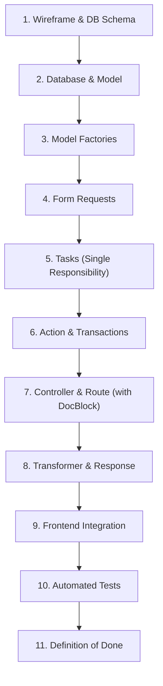

# Workflow Checklist Laravel / Apiato

Checklist hướng dẫn quy trình phát triển API theo kiến trúc Porto/Apiato từ bước lên ý tưởng đến khi hoàn thành. Không reference trong `AGENTS.md`.

---

## 1. Wireframe & Design

- [ ] Phác thảo UI nháp đơn giản: HTML, Figma, ảnh vẽ tay hoặc mã giả Markdown.
- [ ] Xác định các thành phần hiển thị: bảng (table), biểu mẫu (form), ô nhập dữ liệu, nút bấm, bộ lọc (filter), tìm kiếm.
- [ ] Chốt thiết kế API Contract:
  - Resource Model liên quan.
  - REST Endpoint & HTTP Method.
  - JSON Payload gửi lên & JSON Response trả về.
  - Phân quyền (Roles & Permissions).
- [ ] Lập kế hoạch trước các trạng thái UI: `loading`, `error`, `empty`, `success`, `unauthorized`.

---

## 2. Database & Model

- [ ] **Naming**: Tên bảng số nhiều `snake_case` (ví dụ: `orders`), tên cột `snake_case`.
- [ ] **Migration**:
  - Xác định kiểu dữ liệu phù hợp, chỉ định rõ `nullable`, `unique`, `default`.
  - Thiết lập hành vi xóa khóa ngoại deliberately: `cascade`, `set null` hoặc `restrict`.
  - Áp dụng `softDeletes()` cho các dữ liệu nghiệp vụ quan trọng cần lưu trữ lịch sử xóa.
- [ ] **Indexes**: Thêm index trong migration cho tất cả các khóa ngoại (`foreign key`), các trường thường dùng để lọc (`where`), tìm kiếm (`like`), hoặc sắp xếp (`orderBy`).
- [ ] **Model**:
  - Khai báo đầy đủ mảng `$fillable` để bảo mật thuộc tính (Mass Assignment), tuyệt đối không dùng `$guarded = []`.
  - Khai báo kiểu ép dữ liệu `$casts` (boolean, datetime, decimal, array, v.v.) và ẩn các cột nhạy cảm trong `$hidden`.
  - Định nghĩa chính xác các Eloquent relationships giữa các Models liên quan.

---

## 3. Model Factories

- [ ] Tạo Model Factory tương ứng ngay khi tạo Migration.
- [ ] Định nghĩa dữ liệu giả chuẩn cho tất cả các cột bắt buộc.
- [ ] Khai báo các trạng thái đặc biệt (states) hoặc liên kết dữ liệu ngoại khóa của factory để thuận tiện cho việc viết Test sau này.

---

## 4. Form Requests

- [ ] Tạo Request class riêng cho từng endpoint cần validation hoặc phân quyền.
- [ ] Thiết lập phân quyền trong method `authorize()` sử dụng cơ chế `$access` roles/permissions hiện có của Apiato.
- [ ] Khai báo `$decode` cho các trường nhận ID dạng Hash ID từ URL hoặc payload body.
- [ ] Khai báo `$urlParameters` cho các tham số nằm trên đường dẫn URL (như `id`).
- [ ] Viết validation rules chặt chẽ:
  - Xác định rõ `required`, `nullable`, kiểu dữ liệu, `max` length cho chuỗi ký tự khớp với giới hạn DB.
  - Sử dụng rule `sometimes` cho Update Request để hỗ trợ cập nhật từng phần (partial update) an toàn.
  - Validate cả các tham số query đặc trưng nếu có (`limit`, `page`, `orderBy`, `sortedBy`, v.v.).

---

## 5. Tasks (Single Responsibility)

- [ ] Phân rã logic nghiệp vụ thành các bước cực kỳ nhỏ. Mỗi Task chỉ làm một nhiệm vụ duy nhất (SRP) để tối ưu khả năng tái sử dụng.
- [ ] Không cho phép Task gọi Action, không nhận trực tiếp đối tượng `Request` (chỉ nhận tham số nguyên bản như string, array, int).
- [ ] Sử dụng Repository để truy xuất database bên trong Task.
- [ ] Bắt lỗi ngoại lệ từ DB/Thư viện và throw các Exception có ý nghĩa.
- [ ] Viết và chạy **Unit Test cho từng Task** ngay sau khi code xong Task đó để đảm bảo tính đúng đắn trước khi tích hợp.

---

## 6. Action & Transactions

- [ ] Chỉ sử dụng Action đóng vai trò điều phối (orchestrate) luồng nghiệp vụ qua các Task.
- [ ] Tuyệt đối không viết logic truy vấn DB, Eloquent query trực tiếp hay thay đổi trạng thái bản ghi trong Action (hãy chuyển chúng xuống Task thích hợp).
- [ ] **Database Transaction**: Bắt buộc bọc toàn bộ mã nguồn điều phối ghi dữ liệu của Action trong `DB::transaction()` nếu hành động đó tác động lên nhiều bảng hoặc thực hiện nhiều bước ghi liên tiếp.
- [ ] Dispatch các domain events (như gửi email, push log, webhook) ở cuối Action, **phía ngoài block Transaction**, đảm bảo transaction đã commit thành công rồi mới trigger side-effects.

---

## 7. Controller & Route

- [ ] **Controller**: Giữ cực kỳ mỏng. Chỉ nhận Request, gọi duy nhất một Action và trả về response qua Transformer tương ứng. Không chứa logic nghiệp vụ hay truy vấn DB.
- [ ] **Route**:
  - Đặt đúng thư mục `UI/API/Routes`.
  - Đặt tên file theo chuẩn: `{ActionName}.v1.private.php` hoặc `{ActionName}.v1.public.php`.
  - Áp dụng các auth middleware phù hợp cho route private (ví dụ: `auth:api`).
- [ ] **API Documentation**:
  - Bắt buộc viết DocBlock comment `@api` đầy đủ ở đầu mỗi file Route mới.
  - Phân biệt rõ các thẻ: `@apiParam` (URL params), `@apiBody` (Request Body payload), và `@apiQuery` (Query string params).
  - Chạy lệnh `php artisan apiato:apidoc` kiểm tra đầu ra sạch sẽ, không có bất kỳ warning nào.

---

## 8. Transformer & Response

- [ ] Định nghĩa định dạng dữ liệu JSON trả về cho frontend, ẩn hoàn toàn các trường dữ liệu nhạy cảm hoặc cấu trúc DB nội bộ.
- [ ] Sử dụng `$model->getHashedKey()` cho toàn bộ các trường ID (primary key & foreign keys) để bảo mật.
- [ ] Xử lý định dạng dữ liệu (date, decimal, boolean, enum) đồng nhất.
- [ ] Khai báo `$availableIncludes` và `$defaultIncludes` cùng các method `include{RelationName}()` để hỗ trợ eager loading quan hệ động từ frontend. Không chạy các câu lệnh query DB nặng nề trong Transformer.

---

## 9. Frontend Integration

- [ ] Định nghĩa các TypeScript types khớp hoàn toàn với cấu trúc JSON trả về của API.
- [ ] Xử lý các UI states động: `loading`, `error` (hiển thị validation errors tương ứng trên form), `empty` (khi danh sách rỗng), `success`.
- [ ] Cài đặt route guards hoặc auth guards xử lý token đăng nhập nếu là API private.

---

## 10. Automated Tests & Validators

- [ ] Viết **Unit Tests** cho các Tasks nghiệp vụ.
- [ ] Viết **Functional Tests** cho các API endpoints (public/private):
  - Chuẩn bị dữ liệu mẫu trong DB bằng các Model Factories đã tạo.
  - Sử dụng Hashed ID khi gửi payload hoặc gọi URL trong test.
  - Kiểm tra đầy đủ các cases: thành công (200/204), lỗi validation (422), không có quyền (401/403), không tìm thấy (404), và các edge cases khác.
- [ ] Chạy bộ công cụ kiểm tra chất lượng code trước khi bàn giao:
  - `composer validate --strict`
  - `vendor/bin/pint --test`
  - `vendor/bin/psalm --config=psalm.dist.xml`
  - `vendor/bin/phpunit`

---

## 11. Definition of Done

- [ ] Wireframe và API contract đã rõ ràng và thống nhất.
- [ ] Migration đầy đủ ràng buộc khóa ngoại, default value và DB index.
- [ ] Model định nghĩa fillable, casts và relationships đầy đủ.
- [ ] Model Factory đã được tạo và hoạt động tốt.
- [ ] Request thực hiện validation chặt chẽ, phân quyền và decode Hash ID.
- [ ] Action đóng vai trò nhạc trưởng điều phối các Task nhỏ đơn nhiệm.
- [ ] Các tác vụ ghi nhiều bước được bọc trong DB Transaction ở tầng Action.
- [ ] Route có DocBlock comment `@api` đầy đủ, chạy `apiato:apidoc` thành công và không còn bất kỳ warning nào.
- [ ] List API bắt buộc có phân trang (pagination), filter từ DB và không bị lỗi N+1 query.
- [ ] Transformer ẩn hết dữ liệu nhạy cảm và trả về Hashed ID.
- [ ] Đã viết đầy đủ Unit & Functional Tests cho cả cases thành công và thất bại.
- [ ] Bộ kiểm tra cú pháp, tĩnh và test (`pint`, `psalm`, `phpunit`) chạy thành công.
- [ ] Không commit file rác, build artifact, log, cache, database dump hay dữ liệu nhạy cảm (.env).
